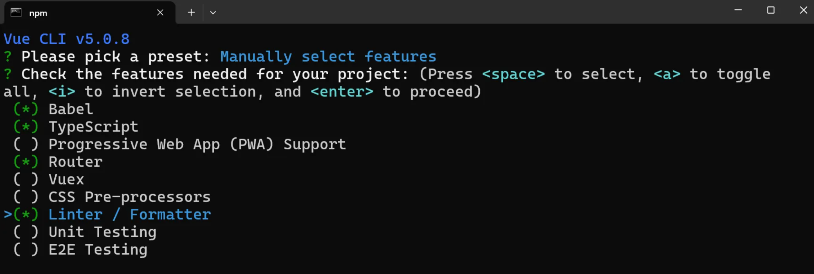

# Web 前端项目初始化模板

Created: November 22, 2024 3:37 PM
Tags: Ant Design, Vue3
Description: 自主打造一套简易的前端开发项目模板

### 确认环境

nodeJS 版本 ≥ 10 均可。

> 尽量下载 LTS 版本（稳定的版本）
若存在多个 node 版本环境，推荐使用快速切换和管理 node 版本的工具 **NVM**。
> 

检测命令：

```bash
node -v
```

### 创建项目

使用 Vue-CLI 脚手架创建 Vue3 的项目：[Vue CLI](https://cli.vuejs.org/zh/)

为什么选择该脚手架？

1. 常用的标准脚手架，开源、并且 star 数多。
2. 目前进入维护模式，相对稳定，对低版本的 Node 兼容性好，不容易出现因为环境不同而导致的问题。
3. 相对轻量，整合了一些前端项目开发常用的工具，并且可以按需选取

该脚手架自动整合了 vue-router 路由、TypeScript、前端工程化等。

可以 [参考官方文档](https://cli.vuejs.org/zh/guide/installation.html) 来安装脚手架工具：

```bash
npm install -g @vue/cli
# 检测是否安装成功
vue -V
```

本项目使用的版本为 @vue/cli 5.0.8 。

创建项目：

```bash
vue create user-center-frontend-vue
```

手动选择特性：




接着用喜欢的 IDE 打开项目，在终端执行 `npm run serve`，访问网页即可。 

### 前端工程化配置

脚手架已经配置了 Prettier 代码美化、 ESLint 自动校验、TypeScript 类型校验、格式化插件等。

如果想关闭 ESLint 校验导致的编译错误（项目无法运行），可以修改 `vue.config.js` 来关闭 `lintOnSave` ：

```tsx
const { defineConfig } = require("@vue/cli-service");
module.exports = defineConfig({
  transpileDependencies: true,
  lintOnSave: "warning",
});
```

修改 `.eslintrc.js` 和 `tsconfig.json`  可以**改变校验规则**。

由于代码格式不符合 Prettier 和 ESLint 的规则，您可以使用以下命令自动修复大多数格式问题：

```bash
npm run lint -- --fix
```

### 引入组件库

引入 Ant Design Vue 组件库， 参考 [官方文档](https://antdv.com/docs/vue/getting-started-cn) 快速上手。

模板使用 v4.6.2 的组件库版本。

执行安装：

```bash
npm i --save ant-design-vue@4.x
```

改变主入口文件 main.ts， 全局注册组件（方便）：

```tsx
import { createApp } from "vue";
import App from "./App.vue";
import router from "./router";
import Antd from "ant-design-vue";
import "ant-design-vue/dist/reset.css";

createApp(App).use(Antd).use(router).mount("#app");
```

随便引入一个组件，如果能显示就表示引入成功。

### 开发规范

建议遵循 Vue3 的**组合式 API**（Composition API），而不是选项式 API，开发会更自由高效一点。

### 全局通用布局

1. **基础布局结构**
在 layouts 目录下新建一个布局 `BasicLayout.vue` ，在 App.vue 全局页面入口文件中引入。、
    
    App.vue 代码如下：
    
    ```tsx
    <template>
      <div id="app">
        <BasicLayout />
      </div>
    </template>
    
    <script setup lang="ts">
    import BasicLayout from "@/layouts/BasicLayout.vue";
    </script>
    <style>
    #app {
    }
    </style>
    ```
    
    选用 Ant design 组件库的 Layout 组件，把 BasicLayout 上中下布局编排好，接着填充内容。
    
    ```tsx
    <template>
      <div id="basicLayout">
        <a-layout style="min-height: 100vh">
          <a-layout-header>Header</a-layout-header>
          <a-layout-content>Content</a-layout-content>
          <a-layout-footer>Footer</a-layout-footer>
        </a-layout>
      </div>
    </template>
    
    <script setup lang="ts"></script>
    
    <style scoped>
    #basicLayout {
    }
    </style>
    
    ```
    
2. **全局底部栏**
通常可以展示版权信息等：
    
    ```tsx
    <a-layout-footer class="footer">
      Vue Project by Kevin
    </a-layout-footer>
    ```
    
    ```css
    #basicLayout .footer {
      background: #efefef;
      padding: 16px;
      position: fixed;
      bottom: 0;
      left: 0;
      right: 0;
      text-align: center;
    }
    ```
    
3. **动态替换内容**
使用 [Vue Router](https://router.vuejs.org/zh/introduction.html) 路由库，可以在 `router/index.ts` 配置路由，能够根据访问的页面地址找到不同的文件并加载渲染。
修改 BasicLayout 的代码如下：
    
    ```tsx
    <a-layout-content class="content">
      <router-view />
    </a-layout-content>
    
    <style scoped>
    #basicLayout .content {
      background: linear-gradient(to right, #fefefe, #fff);
      margin-bottom: 28px;
      padding: 20px;
    }
    </style>
    ```
    
    修改样式，要和底部栏保持一定的外边距，否则可能会导致内容被顶部栏遮住。
    
4. **全局顶部栏**
顶部栏的开发相对复杂，可以基于 Ant Design 的菜单组件来创建 `GlobalHeader` 全局顶部栏组件，**组件统一放在 components 目录中**。
在基础布局中引入顶部栏组件
    
    ```tsx
    <a-layout-header class="header">
      <GlobalHeader />
    </a-layout-header>
    
    <script setup lang="ts">
    import GlobalHeader from "@/components/GlobalHeader.vue";
    </script>
    ```
    
    可以修改下全局 Header 的样式：
    
    ```css
    #basicLayout .header {
      padding-inline: 20px;
      margin-bottom: 16px;
      color: unset;
      background: white;
    }
    ```
    
    修改 GlobalHeader：
    
    1. 给菜单套一层元素，控制整体样式：
        
        ```tsx
        <div id="globalHeader">
          <a-menu v-model:selectedKeys="current" mode="horizontal" :items="items" />
        </div>
        ```
        
    2. 根据需求修改菜单配置，key 为要跳转的 URL 路径：
        
        ```tsx
        <script lang="ts" setup>
        import { h, ref } from "vue";
        import { CrownOutlined, HomeOutlined } from "@ant-design/icons-vue";
        import { MenuProps } from "ant-design-vue";
        
        const current = ref<string[]>(["home"]);
        const items = ref<MenuProps["items"]>([
          {
            key: "/",
            icon: () => h(HomeOutlined),
            label: "主页",
            title: "主页",
          },
          {
            key: "/user/login",
            label: "用户登录",
            title: "用户登录",
          },
          {
            key: "/user/register",
            label: "用户注册",
            title: "用户注册",
          },
          {
            key: "/admin/userManage",
            icon: () => h(CrownOutlined),
            label: "用户管理",
            title: "用户管理",
          },
          {
            key: "others",
            label: h(
              "a",
              { href: "https://github.com/z-Endeavor", target: "_blank" },
              "关于我"
            ),
            title: "关于我",
          },
        ]);
        </script>
        ```
        
    3. 左侧补充网站图标和标题
    整个 logo，放到 src/assets 目录下。
    修改 GlobalHeader 代码：
        
        ```tsx
        <div class="title-bar">
          
          <div class="title">UserCenter</div>
        </div>
        ```
        
        补充 CSS 样式：
        
        ```tsx
        <style scoped>
        .title-bar {
          display: flex;
          align-items: center;
        }
        
        .title {
          color: black;
          font-size: 18px;
          margin-left: 16px;
        }
        
        .logo {
          height: 48px;
        }
        </style>
        ```
        
    4. 右侧展示当前用户的登录状态（暂时用登录按钮代替）：
        
        ```tsx
        <div class="user-login-status">
          <a-button type="primary" href="/user/login">登录</a-button>
        </div>
        ```
        
    5. 采用 **栅格组件的自适应布局**（左中右，左右侧宽度固定，中间菜单栏自适应）
        
        ```tsx
        <a-row :wrap="false">
          <a-col flex="200px">
            <div class="title-bar">
        		  
        		  <div class="title">UserCenter</div>
        		</div>
          </a-col>
          <a-col flex="auto">
            <a-menu
              v-model:selectedKeys="current"
              mode="horizontal"
              :items="items"
            />
          </a-col>
          <a-col flex="80px">
            <div class="user-login-status">
              <a-button type="primary" href="/user/login">登录</a-button>
            </div>
          </a-col>
        </a-row>
        ```
        

### 路由

预期效果：**点击菜单项跳转到相应的页面；且刷新页面，对应的菜单项自动高亮。**

1. 修改路由配置
    
    修改 router/index.ts 文件的 routes 配置，定义我们需要的页面路由，每个 path 对应一个component (要加载的组件)，暂时可以先用 HomeView 代替。
    
    ```tsx
    const routes: Array<RouteRecordRaw> = [
      {
        path: "/",
        name: "home",
        component: HomeView,
      },
      {
        path: "/user/login",
        name: "userLogin",
        component: HomeView,
      },
      {
        path: "/user/register",
        name: "userRegister",
        component: HomeView,
      },
      {
        path: "/admin/userManage",
        name: "adminUserManage",
        component: HomeView,
      },
    ];
    ```
    
2. 给 GlobalHeader 的菜单组件**绑定跳转事件**：
    
    ```tsx
    import { useRoute, useRouter } from "vue-router";
    const router = useRouter();
    
    // 路由跳转事件
    const doMenuClick = ({ key }: { key: string }) => {
      router.push({
        path: key,
      });
    };
    ```
    
    修改 HTML 模板，绑定事件：
    
    ```tsx
    <a-menu
      v-model:selectedKeys="current"
      mode="horizontal"
      :items="items"
      @click="doMenuClick"
    />
    ```
    
3. 同步路由的更新到菜单项高亮
同步高亮原理：
    1. 点击菜单时，Ant Design 组件已经通过 v-model 绑定 current 变量实现了高亮。
    2. 刷新页面时，需要获取到当前的 URL 路径，然后修改 current 的值，从而实现同步。
        
        ```tsx
        const router = useRouter();
        // 当前选中菜单
        const current = ref<string[]>([]);
        // 监听路由变化，更新当前选中菜单
        router.afterEach((to, from, failure) => {
          current.value = [to.path];
        });
        ```
        

### 请求

引入 Aixos 请求库

一般情况下，前端只负责界面展示和动效交互，尽量避免写复杂的逻辑；当需要获取数据
时，通常是向后端提供的接口发送请求，由后端执行操作（比如保存数据）并响应数据给前
端。
前端如何向后端发送请求呢？最传统的方式是使用 AJAX 技术。但其代码有些复杂，我们可以
使用第三方的封装库，来简化发送请求的代码，比如主流的请求工具库 Axios。

1. **请求工具库**
安装，根据 [官方文档](https://axios-http.com/docs/intro)。
    
    ```bash
    npm install axios
    ```
    
2. **全局自定义请求**
    
    需要自定义全局请求地址等，参考 [Axios 官方文档](https://axios-http.com/docs/intro)，编写请求配置文件`src/request.ts`。包括全
    局接口请求地址、超时时间、自定义请求响应拦截器等。
    **响应拦截器的应用场景**：我们需要对接口的 **通用响应** 进行统一处理，比如从 response 中取
    出 data ；或者根据 code 去集中处理错误。这样不用在每个接口请求中都去写相同的逻辑。
    比如可以在全局响应拦截器中，读取出结果中的 data ，并校验 code 是否合法，如果是未登
    录状态，则自动登录。
    示例代码如下，其中 `withCredentials:true` 一定要写，否则无法在发请求时携带 Cookie，
    就无法完成登录。
    
    ```tsx
    import axios from "axios";
    
    const myAxios = axios.create({
      baseURL: "http://localhost:8080",
      timeout: 10000,
      withCredentials: true,
    });
    
    // Add a request interceptor
    myAxios.interceptors.request.use(
      function (config) {
        // Do something before request is sent
        return config;
      },
      function (error) {
        // Do something with request error
        return Promise.reject(error);
      }
    );
    
    // Add a response interceptor
    myAxios.interceptors.response.use(
      function (response) {
        // Any status code that lie within the range of 2xx cause this function to trigger
        // Do something with response data
        console.log(response);
    
        const { data } = response;
        console.log(data);
        // 未登录
        if (data.code === 40100) {
          // 不是获取用户信息接口，或者不是登录页面，则跳转到登录页面
          if (
            !response.request.responseURL.includes("user/current") &&
            !window.location.pathname.includes("/user/login")
          ) {
            window.location.href = `/user/login?redirect=${window.location.href}`;
          }
        }
        return response;
      },
      function (error) {
        // Any status codes that falls outside the range of 2xx cause this function to trigger
        // Do something with response error
        return Promise.reject(error);
      }
    );
    
    export default myAxios;
    ```
    
3. **编写请求代码**
在 src 目录下新建 `src/user.ts` ，存放所有用户相关的 API 借口。根据 Axios 的规则，根据后端接口信息编写对应的代码即可：
    
    ```tsx
    import myAxios from "@/request";
    
    /**
     * 用户注册
     * @param params
     */
    export const userRegister = async (params: any) => {
      return myAxios.request({
        url: "/api/user/register",
        method: "POST",
        data: params,
      });
    };
    
    /**
     * 用户登录
     * @param params
     */
    export const userLogin = async (params: any) => {
      return myAxios.request({
        url: "/api/user/login",
        method: "POST",
        data: params,
      });
    };
    
    /**
     * 用户注销
     * @param params
     */
    export const userLogout = async (params: any) => {
      return myAxios.request({
        url: "/api/user/logout",
        method: "POST",
        data: params,
      });
    };
    
    /**
     * 获取当前用户
     */
    export const getCurrentUser = async () => {
      return myAxios.request({
        url: "/api/user/current",
        method: "GET",
      });
    };
    
    /**
     * 获取用户列表
     * @param username
     */
    export const searchUsers = async (username: any) => {
      return myAxios.request({
        url: "/api/user/search",
        method: "GET",
        params: {
          username,
        },
      });
    };
    
    /**
     * 删除用户
     * @param id
     */
    export const deleteUser = async (id: string) => {
      return myAxios.request({
        url: "/api/user/delete",
        method: "POST",
        data: id,
        // 关键点：要传递 JSON 格式的值
        headers: {
          "Content-Type": "application/json",
        },
      });
    };
    ```
    
    如果后端服务已经就绪，可以尝试在任意页面代码中调用 API ：
    
    ```tsx
    import { getCurrentUser } from "@/api/user";
    
    getCurrentUser().then((res) => {
      console.log(res);
    });
    ```
    
    这里有关前后端服务通信可能会遇到 **跨域问题**（前端网页地址和后端请求接口地址不同），可以通过修改后端代码，增加跨域注解来解决，或者使用其他方式，这边就不赘述。
    

### 全局状态管理

全局状态管理，即为所有页面全局共享的变量，而不是局限在某一个页面中。

适合作为全局状态的数据：已登录用户信息（每个页面几乎都要用）

Pinia 是一个主流的状态管理库，使用简单，可参考 [入门文档](https://pinia.vuejs.org/zh/getting-started.html)。

1. 先按照文档引入 Pinia， 安装后修改 main.ts：
    
    ```tsx
    import { createApp } from "vue";
    import App from "./App.vue";
    import router from "./router";
    import { createPinia } from "pinia";
    import Antd from "ant-design-vue";
    import "ant-design-vue/dist/reset.css";
    
    const pinia = createPinia();
    createApp(App).use(pinia).use(Antd).use(router).mount("#app");
    ```
    
2. 定义状态。在 src/store 目录下定义 user 模块，定义用户存储、远程获取、修改逻辑：
    
    ```tsx
    import { defineStore } from "pinia";
    import { ref } from "vue";
    import { getCurrentUser } from "@/api/user";
    
    export const useLoginUserStore = defineStore("loginUser", () => {
      const loginUser = ref<any>({
        username: "未登录",
      });
    
      async function fetchLoginUser() {
        const res = await getCurrentUser();
        if (res.data.code === 0 && res.data.data) {
          loginUser.value = res.data.data;
        }
      }
    
      function setLoginUser(newLoginUser: any) {
        loginUser.value = newLoginUser;
      }
    
      return { loginUser, setLoginUser, fetchLoginUser };
    });
    ```
    
3. 使用状态。直接使用 store 中导出的状态变量和函数。
可以在首次进入到页面时，尝试获取登录用户信息。修改 App.vue，编写远程获取数据代码：
    
    ```tsx
    const loginUserStore = useLoginUserStore();
    loginUserStore.fetchLoginUser();
    ```
    
    在任何页面中都可以使用数据，比如在页面中直接展示：
    
    ```tsx
    {{ JSON.stringify(loginUserStore.loginUser) }}
    ```
    
    在 userStore 中编写测试代码，测试用户状态的更新：
    
    ```tsx
      async function fetchLoginUser() {
        const res = await getLoginUserUsingGet();
        if (res.data.code === 0 && res.data.data) {
          loginUser.value = res.data.data;
        } else {
          setTimeout(() => {
            loginUser.value = { username: "测试用户", id: 1 };
          }, 3000);
        }
      }
    ```
    
    修改顶部导航栏，在右侧展示登录状态：
    
    ```tsx
    <div class="user-login-status">
      <div v-if="loginUserStore.loginUser.id">
        {{ loginUserStore.loginUser.username ?? "无名" }}
      </div>
      <div v-else>
        <a-button type="primary" href="/user/login">登录</a-button>
      </div>
    </div>
    ```
    
    等待 3 秒后，右上角就能看到用户名“测试用户”了。
    
    测试完成后记得删除或注释掉测试代码。